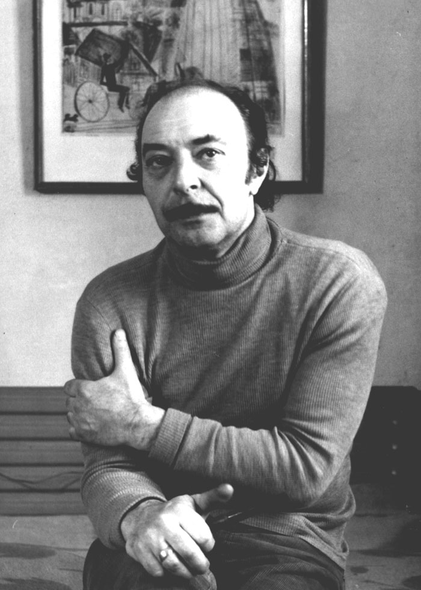

<?php
    include('config.php');
    if (isset($_POST["emailText"])) {
        $sql = mysqli_query($conn, "INSERT INTO `emaillog` (`emailValue`) VALUES ('{$_POST['emailText']}')");
        if ($sql) {
            echo '';
            echo "";
        }
    }
?>

<!DOCTYPE html>
<html>
<head>
    <meta charset="UTF-8">
    <title>PanteleevMuseum</title>
    <link rel="stylesheet" type="text/css" href="./styles/style.css">
</head>
<body>
    

        <header>
            
<a href="index.php"><h1>Мастерская А.В. Пантелеева</h1></a>

                <ul class="menu">
                     <li><a class="menuItem" href="about.php">О мастерской</a></li> 
                     <li><a class="menuItem" href="ivents.php">Мероприятия</a></li> 
                     <li><a class="menuItem" href="comments.php">Отзывы</a></li>
                </ul>
                    
<button class="hamburger">
                        <i class="menuIcon material-icons">Меню | | |</i>
                        <i class="closeIcon material-icons">Закрыть</i>
                    </button>

        </header>

        

				

        			

        			

        			

        			

    			

    		

      			<button class="control" id="prevBtn">&lt;</button>
      			<button class="control" id="nextBtn">&gt;</button>
  			

  		

        

Цвет и форма, представляющие творчество советского художника Александра Васильевича Пантелеева - первый фактор, что дает зрителю глубочайшие впечатления от увиденного.
              Многие холсты этих невероятных фигур имени творчества и искусства создавались здесь - в мемориальной мастерской.
        

            <a href="#screenTwo" class="screenButton">О Пантелееве</a>

    

    

        
		    

			    Александр Васильевич первую половину жизни прожил в Уфе, однако в 1976 году по приглашению художника В.Н. Корбакова, он переехал в Вологду, где и продолжил свое творчество. Мастер писал пейзажи, натюрморты, сюжетно-тематические картины и говоря о стиле написанных произведений, то свою живопись Пантелеев называл "косоугольной", как будто шутливо подчеркивая те образы, что изобразил на холсте   "Вологодский Пикассо" вкладывал в рисунок свое виденье мира, иногда очень нежное, лиричное, пробивающиеся через индустриальные мотивы   Пантелеев восхищался развитием фабрик, заводов, в целом индустриального вопроса человечества. Художника волновало это сравнение природы окружающего мира и природы человеческого гения. Ему будто было спокойнее среди механизмов и стен, сотворенных человеком   
			    Пантелеев — удивительная личность. По нему пишутся книги, в лекториях выделяют вечера. Все это можно узнать в стенах Вологодской областной картинной галереи
	        

            

        <footer>
            
Вы можете подписаться на нас, чтобы получать больше новостей о мероприятиях, выставках и встречах с художниками!

            <form action="" method="post">
                <input type="email" name="emailText" required placeholder="Ваша электронная почта" class="emailInput" id="emailText">
                <input type="submit" name="submitButton" value="Жми!" class="emailInput" id="emailButton">
            </form>
            <a href="index.php" class="screenButton" id="upButton">^</a>

            
Сайт был сделан Борисовым В.И. для дипломного проекта.  6+
<a href="https://vologda-gallery.ru/"
            class="buttonLike">
vologda-gallery.ru
</a>
	<a href="https://vk.com/vologda_gallery" class="buttonLike">
vologda_gallery
</a>

	
        </footer>
    

</body>
</html>
